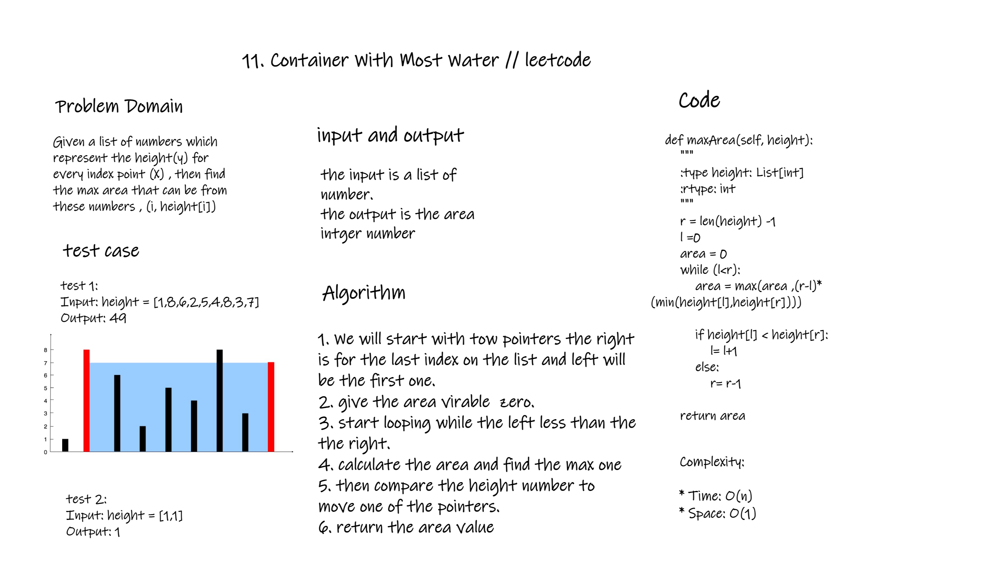
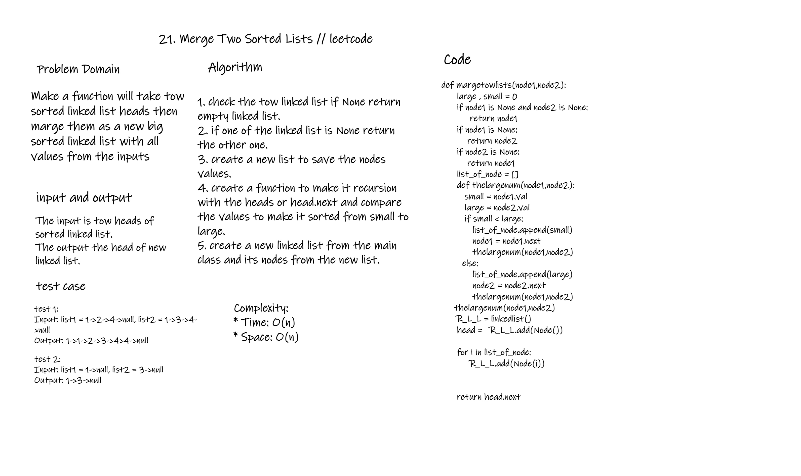
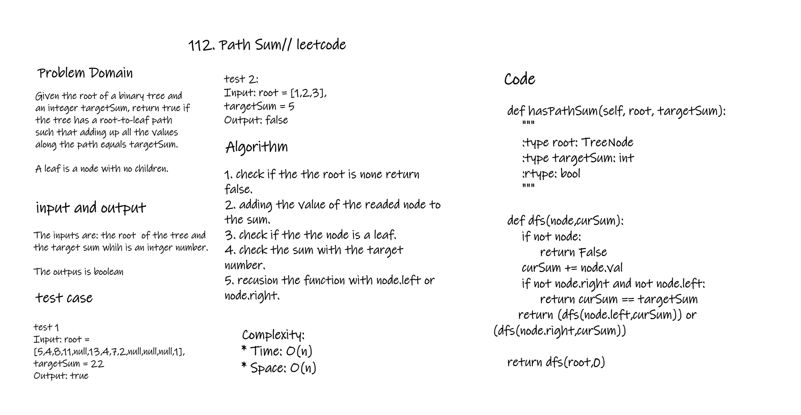

# Computational Thinking
## Ihab Abbas
#### 21-Dec-22

## 1. Using Pointers
### 11. Container With Most Water "Leet code"

## 2. Recursion
### 21. Merge Two Sorted Lists "Leet code"

## 3. DFS
### 112. Path Sum "Leet code"

